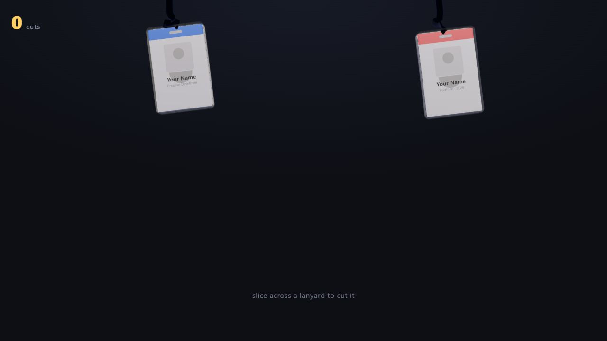

# Lanyard Cut

> An interactive 3D portfolio entrance where visitors swipe through hanging lanyards to unlock the site.




## Overview

Lanyard Cut turns a portfolio landing page into a small physics toy. Visitors swipe across hanging badge straps, watch the severed rope and badge react, and unlock the portfolio after ten cuts. A skip path keeps the experience optional, while a hidden milestone rewards persistent visitors.

## Interaction design

- Verlet-simulated ropes rendered as solid tubes.
- Screen-space swipe intersection for mouse and touch input.
- Rapier rigid-body badges with spring coupling, impulse, torque, and respawn behavior.
- Cut-aligned slice marks, particle bursts, and synthesized sound feedback.
- Progress messages, skip affordance, unlock state, and a 100-cut easter egg.
- Reduced-motion alternatives for ambient animation and marquees.
- A second portfolio scene whose procedural hand fingerspells **L → O → V → E** while scrolling.

## Architecture

The physics and geometry core is pure JavaScript, independent of React and Three.js, so rope behavior, intersection math, progression rules, and hand-pose interpolation can be tested headlessly. React Three Fiber components focus on rendering and interaction.

```text
src/physics/      Verlet rope and swipe intersection math
src/scene/        3D badges, ropes, effects, and easter egg
src/state/        Session-only progression state
src/portfolio/    Scroll-driven portfolio experience
tests/            Physics, geometry, state, and pose tests
```

## Run locally

```bash
npm install
npm run dev
```

Useful checks:

```bash
npm test
npm run build
```

## Video walkthrough

> 🎬 **Coming soon** — reserved for a recording of the cutting interaction, unlock flow, and portfolio transition.
